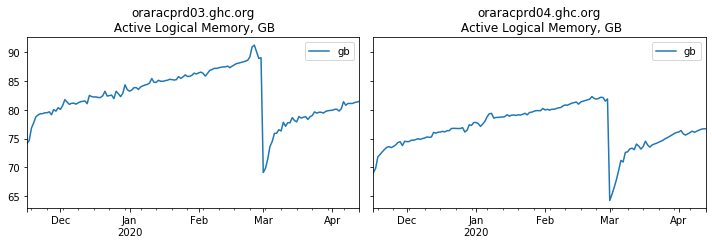

# oracle-pga-memory-leak-analysis
Jupyter Notebook to analyze Oracle 12.2 PGA Memory Leak

This notebook uses combination of existing historical data from OEM repository and from target 12.2 Oracle database
to chart historical PGA memory allocations.
For 12.2 </code>database this notebook has shown a gradual memory leak.

<pre>
opatch lspatches
29770040;OCW JUL 2019 RELEASE UPDATE 12.2.0.1.190716 (29770040) 
29757449;Database Jul 2019 Release Update : 12.2.0.1.190716 (29757449)
</pre>

