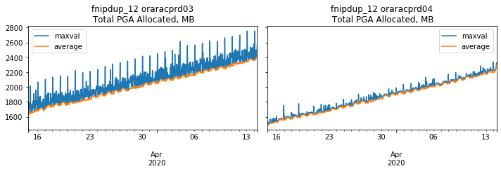

# oracle-pga-memory-leak-analysis
Jupyter Notebook to analyze Oracle 12.2 PGA Memory Leak

This notebook uses combination of existing historical data from OEM repository and from target 12.2 Oracle database
to chart historical PGA memory allocations.
For 12.2 </code>database this notebook has shown a gradual memory leak.

<pre>
opatch lspatches
29770040;OCW JUL 2019 RELEASE UPDATE 12.2.0.1.190716 (29770040) 
29757449;Database Jul 2019 Release Update : 12.2.0.1.190716 (29757449)
</pre>

### OS: Active Logical Memory
Data from OEM sysman.MGMT$METRIC_DAILY, column_label = 'Active Logical Memory, Kilobytes'

Temporary drop is OS patching restart

### 'Total PGA Allocated' from dba_hist_sysmetric_summary

### last snapshot of PGA memory consumers from gV$SESSMETRIC.pga_memory

### PGA history from DBA_HIST_ACTIVE_SESS_HISTORY.pga_allocated
Note that this has only active sessions. Inactive sessions will not be there.

This may explain why MMNL is not listed and why combined PGA size looks lower than above.

Unfortunatley dba_hist_sessmetric_summary is empty and therefore can not be used.

